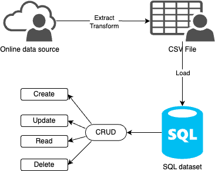

# Complex-SQL-Query-tr

Week 6 Mini-Project
Tianji Rao

## Purpose
The purpose of this project is to use a complex SQL query on a Cloud data sever, Azure, on sample datasets to realize joins, aggregation, and sorting. 
Here, we use `alcohol.csv` as a sample dataset, convert it to a `.db` file. Then, we create a new toy dataset call `toyDB.db` and combin these two datasets. 

## Workflow

## Preparation
1. Create: create a new codespaces with all required packages loaded.   
2. Extract data `make extract`: Extract `alcohol.csv` data from the url.     
3. Transform and load data `make transform_load`.

## Actions 
1. **Format**: `make format`    
2. **Lint**: `make lint`
3. **Test**: `make test`
4. **extract**: `make extract`
5. **transform_load**: `make transform_load`
6. **query**: `make transform_load`